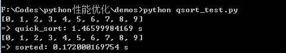

#Python性能优化技巧及原理
​															stevegao(高家华)
***
 > #*课程介绍*
1.  Python性能分析

2.  Python性能优化的技巧

3.  Python性能优化实践

> #*背景知识*
* 适当的Python开发基础
* 常用Python性能分析工具和方法
* 少量的C语言代码阅读调试知识

#1. 少造轮子

Python的标准库核心组件大都是用经过优化的C语言写成的。因此不需要你自建，而且你自建的很可能会更慢。使用Python给定的数据结构，列表、元组、集合和字典这些数据类型，不要去在Python层去自定义。使用Python核心库组件的算法，少造轮子。

##1.1 二分查找
二分查找是大家比较容易接触到的一个算法，应用也很广泛。
- ### 一个轮子：


```python
def bsearch(a, x, lo=0, hi=None):
	if lo < 0:
		raise ValueError('lo must be non-negative')
	if hi is None:
		hi = len(a)
	while lo < hi:
		mid = (lo+hi)//2
		if a[mid] < x: lo = mid+1
		else: hi = mid
	return lo
```
***
- ### 使用库函数：

```python
import bisect
bisect.bisect_left(a,k)
```
***
- ### 性能测试：
```python
with timer.Timer() as t:
    a = range(1000*1000)
    for i in xrange(1000*1000):
        k = 100
        bisect.bisect_left(a,k)# or bsearch(a, k)
print "=> bisect: %s s" % t.secs
```
- ### 测试结果:
  
***
- ### **原因分析**:

  + **源码分析  Python-src\Modules\_bisectmodule.c**
  + **python调试演示**
  + **windows c语言python源码调试演示**

##1.2 排序
- ### 一个轮子:
```python
def quick_sort(lists, left, right):
    # 快速排序
    if left >= right:
        return lists
    key = lists[left]
    low = left
    high = right
    while left < right:
        while left < right and lists[right] >= key:
            right -= 1
        lists[left] = lists[right]
        while left < right and lists[left] <= key:
            left += 1
        lists[right] = lists[left]
    lists[right] = key
    quick_sort(lists, low, left - 1)
    quick_sort(lists, left + 1, high)
    return lists
```
- ### 对应的库函数:
```python
l = [6,4,2,1,7,8,9,3,0,5]
rs = sorted(l)
```
- ### 执行1000次性能测试:
  
- ### 原因分析：
  \###python源码定位###
```python
Python-src\Python\bltinmodule.c      builtin_sorted
Python-src\Objects\listobject.c		 PyList_Sort
```
   ***
#2. 使用效率更高的语法
##2.1 字符串连接
- ### 先做一个小测试:
```python
#join_test.py
import timer
jlist_long = ["a",  "b", "a",  "b","a",  "b","a",  "b","a",  "b" ]
jlist_short =  ["a",  "b"]
MAX_RANGE =  10 * 1000 * 1000
def test_join0():
	for i in xrange(MAX_RANGE):
		rs =  "a" + "b"

def test_join1():
	for i in xrange(MAX_RANGE):
		rs =  "".join(jlist_short)

def test_join2():
	for i in xrange(MAX_RANGE):
			rs = jlist_long[0] +  jlist_long[1] +  jlist_long[2] +  jlist_long[3] +  jlist_long[4] +  jlist_long[5] +  jlist_long[6] +  jlist_long[7] + jlist_long[8] + jlist_long[9]

def test_join3():
	for i in xrange(MAX_RANGE):
			rs =  "".join(jlist_long)
```
- ### 性能测试展示######
  
- 结论
  + 简短的字符串连接，可以用+
  + 连接一个list用join
***
- ### 源代码分析:    

"+" 连接字符串 Python-2.7.9-src\Objects\stringobject.c  -> string_concat

***
***
***
join连接字符串  Python-2.7.9-src\Objects\stringobject.c  -> string_join
   

## 2.2 range和xrange（python3不适用）


- ### 效率不好的语法

```python
for i in range(1000):
	dosomething()
```
- ### 效率改进

```python
for i in xrange(1000):
	dosomething()
```
- ### 原因分析：

从下图是range的关键代码，由此看出range的本质就是创建一个list。

Python-2.7.9-src\Python\bltinmodule.c   ->  builtin_range
  

下面来看xrange，在python中调用xrange会创建下边这个结构体

Python-2.7.9-src\Objects\rangeobject.c (下列三幅图，都来自此文件)


然后直接开始迭代


较大量的数字序列的话，range在生成list这一步需要开辟内存空间并赋值，相比下xrange的效率就好很多了。

 其实python源码中已经写的很清楚了，xrange这种生成器的方式确实比range效率要高。


##2.3 循环优化

- ### 将列表中的所有单词变成大写的一般写法
```python
newlist = []
for word in oldlist:
    newlist.append(word.upper())
```
### 2.3.1列表推导
```python
newlist = [s.upper() for s in oldlist]
```
- 带if语句的列表推导
```python
names = ['Bob','Tom','alice','Jerry','Wendy','Smith']
newlist = []
for name in names:
    if len(name) > 3:
        newlist.append(name.upper())
```
***
```python
names = ['Bob','Tom','alice','Jerry','Wendy','Smith'] 
newlist = [name.upper() for name in names if len(name)>3]  
```
- ### 字典推导
```python
strings = ['import','is','with','if','file','exception']  
D = {key: val for val,key in enumerate(strings)}  
>>> D  
{'exception': 5, 'is': 1, 'file': 4, 'import': 0, 'with': 2, 'if': 3}  
```
- ### 集合推导
```python
strings = ['a','is','with','if','file','exception']  
S = {len(s) for s in strings}
>>>S
set([1, 2, 4, 9])#set 没有重复项
```
- ### 性能比较

  

- ### 原因分析

  之前的几次性能分析都是使用源码和调试的方式，这次换一种分析方式，字节码比较。

  Python虽然是一个解释型语言，但是代码最终还是会编译成字节码，字节码需要处理才能被理解，dis模块把字节码转换成人能读懂的形式，然后我们进行分析。

  ```python
  python -m dis xxx.py
  ```

​      字节码比较：


List_Append调用栈比较：


### 2.3.2 map函数

* ###  进行优化
  map()接收一个函数 f 和一个 list，并通过把函数 f 依次作用在 list 的每个元素上，得到一个新的 list 并返回

```python
map(doSomethingWithX, xrange(0,100))
```
- ###功能对比

  ```Python
  #map_test.py
  oldlist =  ['Bob','Tom','alice','Jerry','Wendy','Smith']
  newlist = []
  for word in oldlist:
  	newlist.append(word.upper())
  print newlist

  oldlist =  ['Bob','Tom','alice','Jerry','Wendy','Smith']
  newlist = map(lambda x: x.upper(),oldlist)
  print newlist

  oldlist =  ['Bob','Tom','alice','Jerry','Wendy','Smith']
  newlist = [s.upper() for s in oldlist]		
  print newlist
  ```

  ***

  


* 原因分析

  原理和列表推导类似

### 2.3.3 两种方式的优劣
- 继续转成大写字母的例子
```Python
#map_test2.py
from timer import *

MAX = 5000000

with Timer() as t:
	for i in xrange(MAX):
	
		oldlist =  ['Bob','Tom','alice','Jerry','Wendy','Smith']
		newlist = []
		for word in oldlist:
			newlist.append(word.upper())
			
print "for %s"%t.secs

with Timer() as t:
	for i in xrange(MAX):
	
		oldlist =  ['Bob','Tom','alice','Jerry','Wendy','Smith']
		newlist = map(lambda x: x.upper(),oldlist)
		
print "map %s"%t.secs

with Timer() as t:
	for i in xrange(MAX):
	
		oldlist =  ['Bob','Tom','alice','Jerry','Wendy','Smith']
		newlist = [s.upper() for s in oldlist]
		
print "list compre %s"%t.secs
```

***


- 都使用函数
```Python
#map_test3.py
from timer import *

MAX = 1000000

oldlist =  range(1, 10)
def doSomethingWithX(x):
	return x*x

with Timer() as t:
	for x in xrange(0, MAX):
		newlist = []
		for x in  oldlist:
			newlist.append(doSomethingWithX(x))
print "for %s"%t.secs

with Timer() as t:
	for x in xrange(0, MAX):
		newlist =  map(doSomethingWithX,  oldlist)
print "map %s"%t.secs

with Timer() as t:
	for x in xrange(0, MAX):
		newlist = [doSomethingWithX(i) for i in  oldlist]
print "list compre %s"%t.secs
```

***


- 结论
  + 如果使用同样的函数，map速度更快
  + 但列表推导的语法更灵活，简单表达式速度更好


## 2.4 其他技巧

- 文件处理

  ```Python
  fobj = open("data.txt")
  lines = fobj.readlines()#当文件较大时，消耗内存
  for line in  lines:
      doSomethingWith(line)
  ```
  ***
  ```Python
  with open("data.txt") as  f:
      for line in  f:
          doSomethingWith(line)
  ```

  ***

  

  ​

- 在处理大列表的时候，可以使用生成器来动态生成列表元素
```Python
#my_struct = (x**2 for x in range(100))
my_stucct =  [x**2 for x in range(100)]
for number in my_struct:
    doSomethingWith(number) 
```


- 成员关系测试，多用in；查询交集并集等操作，先转换成集合

  ```Python
  from timer import *

  MAX =  10000000
  my_list = ['a','b','is','python','jason','hello','hill','with','phone','test', 
  'dfdf','apple','pddf','ind','basic','none','baecr','var','bana','dd','wrd']
  key = "blue"
  def test():
  	with Timer() as t:
  		for i in xrange(MAX):
  			rs = False
  			for item in my_list:
  				if key == item:
  					rs =  True
  					break
  	print  "for if %s" % t.secs

  	with Timer() as t:
  		for i in xrange(MAX):
  			rs = False
  			if key in my_list:
  				rs =  True
  	print  "list in %s" % t.secs
  	
  	myset = set(my_list)
  	with Timer() as t:
  			for i in xrange(MAX):
  				rs = False
  				if key in myset:
  					rs =  True
  	print  "set in %s" % t.secs
  ```

  ***

  

  ​

- 密集循环内，减少函数调用，直接内联代码，可以更加高效，但代价是损害代码的可读性和维护便利性


#3. python脚本运行方式

区分两个名词

CPython

Cython

##3.1 PyPy

PyPy是Python实现的Python解释器。


-   主要特性-速度

PyPy的一个主要特性是对普通Python代码运行速度的优化。这是由于它使用JIT（Just-in-time）编译器。


-   常见的代码执行方式  
    + 编译执行

    + 解释执行

      ​
-   JIT

JIT技术是两者的结合，首先让代码解释执行，同时收集信息，在收集到足够信息的时候，将代码动态编译成CPU指令，然后用CPU指令替代解释执行的过程，因为编译发生在马上要执行之前，所以叫做Just-In-Time Compiler。编译之后速度就是编译执行的速度了，比解释执行要快得多，所以运用JIT的PyPy很多情况下会比普通的CPython要快。
-   其他特性

    + 内存占用
    + 沙盒
    + 无栈特性

-   安装 

不是一个Python模块，而是另一个Python解释器
http://pypy.org/download.html

-   使用

```Python
python xxx.py
pypy xxx.py
```

- 速度测试对比
```Python
#pypy_test.py
from timer import Timer
with Timer() as t:
	for i in xrange(100000):
		rs = 0
		for i in xrange(1000):
			rs += i
print "=> elasped : %s s" % t.secs
```
***

##3.2 Cython

将Python源代码转换成c语言代码，然后再从c代码编译成2进制程序


- 安装

  http://cython.org/#download

  pip install Cython

  ​

- 使用

```Python
#Cython_compute.pyx
def test():
  	for i in xrange(100000):
  		rs = 0
  		for i in xrange(1000):
  			rs += i
```
***
```Python
#setup.py
from distutils.core import setup
from Cython.Build import cythonize
setup(name = 'Cpython_test app',
      ext_modules = cythonize("Cython_compute.pyx"))
```
***
```Shell
python setup.py build
#如果windows下build失败，升级python至最新版本，升级setuptools至最新版本，从vs（测试使用vs2012）本地命令行进入，SET VS90COMNTOOLS=%VS110COMNTOOLS%
python setup.py install
```
```Python
#Cython_test.py
from timer import Timer
from Cython_compute import *
if __name__ == '__main__':
	with Timer() as t:
		test()
	print "Cython %s"%t.secs
```

- 性能对比

  


## 3.3 没有银弹
通过上面的测试会发现pypy的能力是无与伦比的

但是**操作数字的小程序是比较容易被优化**

demo测试的结论无法代表实际项目中的效果，实际项目中PyPy和Cython不一定普通的Python会快。


#4. 进入Python底层

单纯的从脚本运行方式上下手不是绝对稳妥，但是走向底层绝对不会错。

## 4.1 ctypes

ctypes库可以让开发者直接进入Python的底层，借助C语言的力量进行开发。这个库只有官方版本解释器（CPython）里面才有，因为这个版本是C语言写的。

- ### 加载自定义的ctypes

  有时，无论我们在代码上用了多少优化方法，可能都没法儿满足我们对性能的要求。这时我们可以把关键代码写成C语言，编译成一个库，然后导入Python当作模块使用。
```C
//dll2ctypes.cpp
int WINAPI c_check_prime(int a)
{
	int c;
	for ( c = 2 ; c <= sqrt((float)a) ; c++ ) {
		if ( a%c == 0 )
			return 0;
	}
	return 1;
}
```
***
```Python
#ctypes_test.py
import math
from timer import *
import ctypes

MAX = 1000000
def check_prime(x):
    values = xrange(2, int(math.sqrt(x)))
    for i in values:
        if x % i == 0:
            return False
    return True
	
c_check_prime = ctypes.CDLL(r'.\ctypes\dll2ctypes\x64\Release\dll2ctypes.dll').c_check_prime


with Timer() as t:
	numbers_py = [x for x in xrange(MAX) if check_prime(x)]
print "python %s"%t.secs

with Timer() as t:
	numbers_py = [x for x in xrange(MAX) if c_check_prime(x)]
print "ctypes %s"%t.secs
```
- 性能对比结果

  

## 4.2 SWIG

SWIG是一种软件开发工具。它能让一些脚本语言调用C/C++语言的接口。

- 安装

  下载地址[http://www.swig.org/download.html](http://www.swig.org/download.html)

- 简单例子
```C
/* File : example.c */  
double  My_variable  = 3.0;   
/* Compute factorial of n */  
int  fact(int n) {  
    if (n <= 1) return 1;  
    else return n*fact(n-1);  
}  
/* Compute n mod m */  
int my_mod(int n, int m) {  
    return(n % m);  
}  
```

你想在你的脚本语言的代码里面调用fact函数。先写一段非常简单的SWIG脚本，文件名为example.i：
```C
/* File : example.i */  
%module example  
%{  
/* Put headers and other declarations here */  
extern double My_variable;  
extern int    fact(int);  
extern int    my_mod(int n, int m);  
%}   
extern double My_variable;  
extern int    fact(int);  
extern int    my_mod(int n, int m);  
```

***

```Python
#setup.py
from distutils.core import setup, Extension
setup(name='example',
      version='1.0.0',
      description='Simple SWIG example ',
      ext_modules=[Extension('_example', sources=['example.c', 'example.i'])]
      )
```

***

- 编译

  类似之前的Cython编译
```shell
python setup.py build_ext --inplace
```
- 运行
```Python
import example 
print example.fact(4)  
print example.my_mod(23,7)
print example.cvar.My_variable + 4.5  
```


